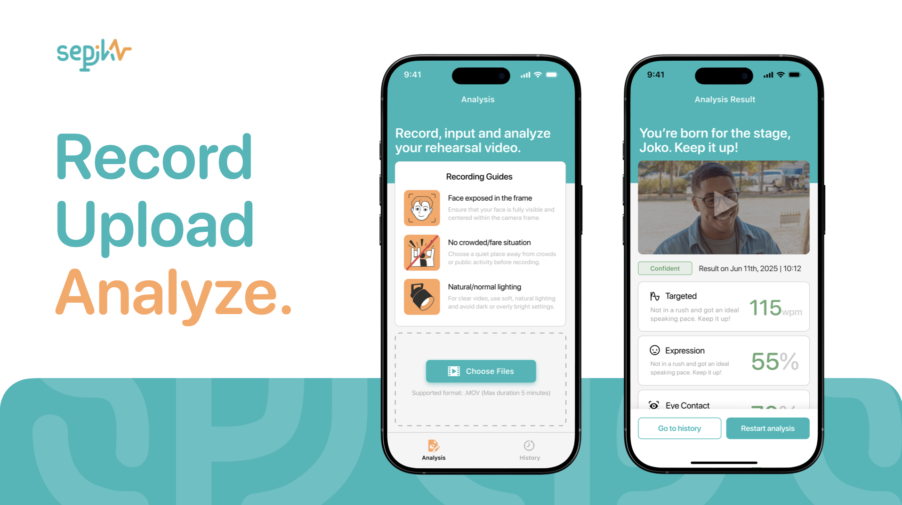

# Sepik 🎤




Sepik is an advanced iOS application designed to help users improve their public speaking skills through comprehensive video analysis. Using cutting-edge machine learning and computer vision technologies, Sepik analyzes speaking practice videos to provide detailed feedback on facial expressions, speech patterns, eye contact, and overall performance.

## 🌟 Features

- **Video Upload & Analysis:** Upload speaking practice videos (.MOV format) for comprehensive analysis
- **Face Detection:** Validate that videos contain human faces using Apple Vision Framework
- **Facial Expression Analysis:** Track smile frequency and facial expressions using Core ML
- **Speech Pattern Analysis:** Analyze speaking pace (WPM), detect filler words, and evaluate speech quality
- **Eye Contact Tracking:** Monitor eye contact patterns for better audience engagement
- **Performance Scoring:** Get confidence scores based on multiple criteria (Confident, Neutral, Nervous)
- **History Tracking:** Access detailed analysis history with performance trends
- **Animated Loading:** Beautiful frame-by-frame animation during analysis processing
- **Onboarding Experience:** Guided introduction with swipeable slides and user personalization
- **SwiftUI Interface:** Modern, responsive UI with smooth animations and transitions
- **Memory Optimization:** Efficient processing for videos up to 10 minutes in length

## 🛠️ Tech Stack


- **Swift** as the programming language
- **SwiftUI** for the user interface
- **SwiftData** for local data persistence
- **Core ML** for facial expression recognition (SmileDetection.mlmodel)
- **Vision Framework** for face detection and validation
- **Speech Framework** for speech-to-text analysis
- **AVFoundation** for video processing and playback
- **MVVM Architecture** for clean, maintainable code structure

## 📋 Requirements

- iOS 17.0+
- Xcode 15.0+
- Swift 5.9+
- Device with camera capability
- Microphone access for speech analysis

## 🚀 Installation

### Prerequisites

- Xcode 15.0 or later
- iOS 17.0 or later
- macOS Ventura or later (for development)
- Active Apple Developer account (for deployment)

### Steps

1. **Clone Repository:**

```bash
git clone https://github.com/zachisoni/sepik.git
```

2. **Open Project in Xcode:**

```bash
cd sepik
open Sepik.xcodeproj
```

3. **Install Dependencies:**

The project uses native iOS frameworks. No external dependencies required.

4. **Build and Run:**

Select your target device or simulator and press ⌘+R to build and run the application.

5. **Required Permissions:**

The app requires the following permissions:

- Camera/Photo Library access to upload videos
- Microphone access for speech analysis
- Speech recognition for detailed analysis

## 📂 Project Structure

```plaintext
Sepik/
├── Sepik/
│   ├── SepikApp.swift                    # App entry point
│   ├── Assets.xcassets/                  # App assets and loading animation frames
│   │   ├── loading_1.imageset/           # Frame 1 of 232 loading animation frames
│   │   ├── loading_2.imageset/
│   │   └── ...                           # (232 total frames)
│   ├── Models/                           # Data models
│   │   ├── AnalysisResult.swift
│   │   ├── PracticeSession.swift
│   │   └── Video.swift
│   ├── Services/                         # Core services
│   │   ├── DataManager.swift
│   │   ├── FaceDetectionService.swift
│   │   ├── FacialExpressionAnalyzer.swift
│   │   ├── SpeechAnalyzer.swift
│   │   ├── EyeContactAnalyzer.swift
│   │   └── UserManager.swift
│   ├── ViewModels/                       # MVVM ViewModels
│   │   ├── AnalysisViewModel.swift
│   │   ├── HistoryViewModel.swift
│   │   ├── OnboardingViewModel.swift
│   │   ├── InputNameViewModel.swift
│   │   └── PracticeViewModel.swift
│   ├── Views/                            # SwiftUI Views
│   │   ├── OnboardingView.swift
│   │   ├── TabContainerView.swift
│   │   ├── MainTabView.swift
│   │   ├── PracticeView.swift
│   │   ├── LoadingView.swift
│   │   ├── FrameAnimationView.swift
│   │   ├── ResultView.swift
│   │   ├── HistoryView.swift
│   │   └── NotFoundView.swift
│   ├── SmileDetection.mlmodel           # Core ML model for facial expression
│   └── SmileDetection.mlmodelc/         # Compiled ML model
├── loading_motion/                       # Original loading animation frames
└── README.md
```

## 🧩 Key Components

### Core Analysis Engine

- **FacialExpressionAnalyzer**: Uses Core ML to detect smiles and neutral expressions
- **SpeechAnalyzer**: Processes audio for word count, pace (WPM), and filler word detection
- **EyeContactAnalyzer**: Tracks eye contact patterns using computer vision
- **FaceDetectionService**: Validates video content before analysis

### User Interface

- **OnboardingView**: Multi-slide introduction with user name input
- **PracticeView**: Video upload interface with recording requirements
- **LoadingView**: Animated loading screen with 232-frame animation
- **ResultView**: Comprehensive analysis results with performance metrics
- **HistoryView**: Session history with expandable cards and performance trends
- **NotFoundView**: Friendly feedback when no face is detected in video

### Data Management

- **SwiftData Integration**: Persistent storage for analysis results and sessions
- **Memory Optimization**: Efficient processing for long videos with progressive analysis
- **Error Recovery**: Robust error handling and retry mechanisms

## 🔍 Usage

1. **Onboarding:** Complete the introduction slides and enter your name
2. **Upload Video:** Select a .MOV video file (max 10 minutes) from your device
3. **Face Validation:** App automatically validates that video contains a human face
4. **Analysis Processing:** Watch the beautiful loading animation while AI analyzes your video
5. **View Results:** Get detailed feedback on expressions, speech patterns, and eye contact
6. **Performance Scoring:** Receive overall confidence assessment (Confident/Neutral/Nervous)
7. **History Review:** Track your progress over time in the History tab
8. **Continuous Improvement:** Use insights to enhance your public speaking skills

## 🎯 Analysis Criteria

### Facial Expression Score

- **Excellent (2 points):** >30% smile frequency
- **Good (1 point):** 15-30% smile frequency
- **Needs Improvement (0 points):** <15% smile frequency

### Speech Quality Score

- **Filler Words:** ≤2 (Excellent), 3-4 (Good), >4 (Needs Improvement)
- **Speaking Pace:** 110-150 WPM (Excellent), 90-109 or 151-170 WPM (Good)

### Eye Contact Score

- **Excellent (2 points):** 60-70% eye contact
- **Good (1 point):** 40-59% or 71-80% eye contact
- **Needs Improvement (0 points):** <40% or >80% eye contact

### Overall Confidence Assessment

- **Confident:** 7-8 total points
- **Neutral:** 5-6 total points
- **Nervous:** 0-4 total points

## 🤝 Contributing

Contributions are welcome! Please feel free to submit a Pull Request.

1. Fork the repository
2. Create your feature branch (`git checkout -b feature/amazing-feature`)
3. Commit your changes (`git commit -m 'Add some amazing feature'`)
4. Push to the branch (`git push origin feature/amazing-feature`)
5. Open a Pull Request

## 📄 License

This project is licensed under the MIT License - see the [LICENSE](LICENSE) file for details.

## 🙏 Acknowledgments

- Apple Developer Documentation for Core ML, Vision, and Speech frameworks
- SwiftUI and SwiftData community for resources and examples
- Machine learning community for facial expression recognition techniques
- Beta testers who provided valuable feedback during development
- Our development team for creating an intuitive and powerful speaking analysis tool

## Contributors

<a href="https://github.com/zachisoni/sepik/graphs/contributors">
    
</a>

---

> Empowering speakers worldwide to achieve confidence and excellence in public speaking through AI-powered analysis and personalized feedback.
